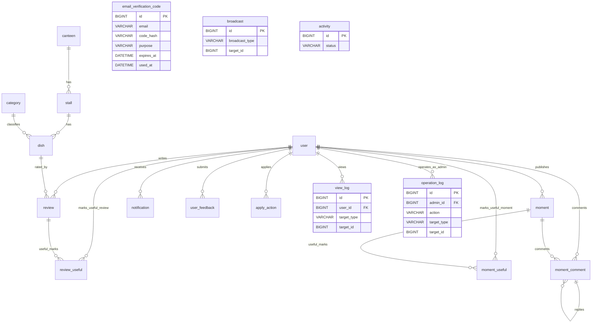

# 数据库设计（食在交大 bjtu_food）

> 本文档基于 `server/src/main/resources/db/schema.sql` 自动核对生成，与当前实现严格一致。
> 数据库名：`bjtu_food`；字符集：`utf8mb4` / `utf8mb4_general_ci`；引擎：`InnoDB`。

## 1. 设计约定

| 约定 | 说明 |
|------|------|
| Schema | 所有表与迁移脚本均使用 `bjtu_food` 库（脚本内 `CREATE DATABASE IF NOT EXISTS` + `USE bjtu_food`） |
| 主键 | 业务表统一 `BIGINT AUTO_INCREMENT`；`email_verification_code` 等同样自增主键 |
| 时间戳 | `created_at` 默认 `CURRENT_TIMESTAMP`；`updated_at` 默认 `CURRENT_TIMESTAMP ON UPDATE CURRENT_TIMESTAMP`（由 `MybatisMetaObjectHandler` 统一写入） |
| 金额 | 以「分」为单位存储 `INT`（如 12.00 元 = `1200`），避免浮点误差 |
| 多图/列表 | JSON 字符串存储（如 `["url1","url2"]`）；`review.images` / `moment.images` 为逗号分隔或 JSON，按表定义 |
| 审核流 | UGC 实体（`dish`/`stall`/`canteen`/`moment`/`apply_action`）含 `audit_status`（pending/approved/rejected）、`reject_reason`、`created_by`；后台录入默认 `approved` |
| 角色 | `user.role`：`student`（默认）/ `admin` / `super_admin`；`verified` 仅表示邮箱认证态，**不进 JWT**，后端实时判定 |
| 外键 | 逻辑外键为主（`user_id`/`stall_id`/`dish_id` 等建普通索引）；脚本中 `SET FOREIGN_KEY_CHECKS` 用于迁移幂等，业务层以应用级关联为主 |
| 幂等迁移 | MySQL 不支持 `ADD COLUMN IF NOT EXISTS` / `CREATE INDEX IF NOT EXISTS`，旧库升级通过存储过程 + `INFORMATION_SCHEMA` 判断补齐 |

## 2. 表清单（共 18 张业务表）

`user` · `canteen` · `stall` · `dish` · `review` · `review_useful` · `notification` · `category` · `broadcast` · `activity` · `user_feedback` · `apply_action` · `moment` · `moment_useful` · `moment_comment` · `email_verification_code` · `view_log` · `operation_log`

> 说明：`review_useful` 与 `review.useful_count` 冗余列配合使用（一人一票，由聚合维护）；`favorites` 收藏表已整体移除（见 `task-12.12`）。

---

## 3. 表结构详情

### 3.1 user（用户）
| 字段 | 类型 | 可空 | 默认 | 说明 |
|------|------|------|------|------|
| id | BIGINT | 否 | AUTO | 用户ID |
| username | VARCHAR(64) | 否 | '' | 学号/工号；游客建号为 `wx_`+openid 尾16位（唯一） |
| email | VARCHAR(128) | 可 | NULL | 校园邮箱（历史迁移凭证；游客为 NULL） |
| password | VARCHAR(128) | 可 | NULL | 密码哈希（仅管理员后台用，学生侧不校验） |
| nickname | VARCHAR(64) | 否 | '' | 昵称 |
| avatar | VARCHAR(512) | 可 | NULL | 头像URL |
| role | VARCHAR(32) | 否 | 'student' | student/admin/super_admin |
| status | VARCHAR(32) | 否 | 'active' | active/disabled/deleted |
| openid | VARCHAR(64) | 可 | NULL | 微信 openid（静默登录取号依据，唯一） |
| unionid | VARCHAR(64) | 可 | NULL | 微信 unionid（可空） |
| verified | TINYINT | 否 | 0 | 认证态：0=游客 / 1=已邮箱认证 |
| bind_email | VARCHAR(128) | 可 | NULL | 已认证绑定邮箱（仅存关系，可空） |
| verified_at | DATETIME | 可 | NULL | 认证时间 |
| created_at | DATETIME | 否 | NOW | 创建时间 |
| updated_at | DATETIME | 否 | NOW | 更新时间 |
| last_login_at | DATETIME | 可 | NULL | 最近登录时间 |

**索引/约束**：PK(`id`)；UNIQUE `uk_user_username`(`username`)；UNIQUE `uk_user_email`(`email`)；UNIQUE `uk_user_openid`(`openid`)。

### 3.2 canteen（食堂）
| 字段 | 类型 | 可空 | 默认 | 说明 |
|------|------|------|------|------|
| id | BIGINT | 否 | AUTO | 食堂ID |
| name | VARCHAR(64) | 否 | '' | 食堂名称 |
| images | VARCHAR(1024) | 可 | NULL | 图片URL列表 JSON |
| location | VARCHAR(128) | 可 | NULL | 食堂位置 |
| description | VARCHAR(512) | 可 | NULL | 描述 |
| latitude | DECIMAL(10,6) | 可 | NULL | 纬度（GCJ-02，首页「距你 Xm」依赖） |
| longitude | DECIMAL(10,6) | 可 | NULL | 经度（GCJ-02） |
| status | VARCHAR(32) | 否 | 'open' | open/closed |
| sort_order | INT | 否 | 0 | 排序权重（小靠前） |
| audit_status | VARCHAR(32) | 否 | 'approved' | pending/approved/rejected |
| reject_reason | VARCHAR(255) | 可 | NULL | 退回原因 |
| created_by | BIGINT | 可 | NULL | 提交人用户ID |
| created_at / updated_at | DATETIME | 否 | NOW | 时间戳 |

**索引/约束**：PK(`id`)。

### 3.3 stall（档口）
| 字段 | 类型 | 可空 | 默认 | 说明 |
|------|------|------|------|------|
| id | BIGINT | 否 | AUTO | 档口ID |
| canteen_id | BIGINT | 否 | 0 | 所属食堂ID |
| name | VARCHAR(64) | 否 | '' | 档口名称 |
| images | VARCHAR(1024) | 可 | NULL | 多图 JSON |
| location | VARCHAR(128) | 可 | NULL | 位置 |
| floor | VARCHAR(16) | 可 | NULL | 楼层（如 1F） |
| window_no | VARCHAR(32) | 可 | NULL | 窗口号 |
| business_hours | VARCHAR(64) | 可 | NULL | 营业时间 |
| description | VARCHAR(512) | 可 | NULL | 描述 |
| sort_order | INT | 否 | 0 | 排序权重 |
| status | VARCHAR(32) | 否 | 'open' | open/closed |
| audit_status | VARCHAR(32) | 否 | 'approved' | 审核态 |
| reject_reason | VARCHAR(255) | 可 | NULL | 退回原因 |
| created_by | BIGINT | 可 | NULL | 提交人 |
| created_at / updated_at | DATETIME | 否 | NOW | 时间戳 |

**索引/约束**：PK(`id`)；KEY `idx_stall_canteen`(`canteen_id`)。

### 3.4 dish（菜品）
| 字段 | 类型 | 可空 | 默认 | 说明 |
|------|------|------|------|------|
| id | BIGINT | 否 | AUTO | 菜品ID |
| stall_id | BIGINT | 否 | 0 | 所属档口ID |
| category_id | BIGINT | 可 | NULL | 品类ID（首页品类滚轮筛选；可空=未分类） |
| name | VARCHAR(64) | 否 | '' | 菜品名称 |
| price | INT | 否 | 0 | 价格（分） |
| original_price | INT | 可 | NULL | 原价（分，折扣前） |
| promo_price | INT | 可 | NULL | 促销价（分，非空=有折扣） |
| description | VARCHAR(512) | 可 | NULL | 描述 |
| images | VARCHAR(1024) | 可 | NULL | 多图 JSON |
| tags | VARCHAR(128) | 可 | NULL | 逗号分隔：recommended/signature |
| region | VARCHAR(32) | 可 | NULL | 地域（美食来源地），如 清真/川湘/西北/粤式/东北（一期扩展，schema.sql 存储过程幂等追加） |
| spice_level | INT | 否 | 0 | 辣度：0不辣/1微辣/2中辣/3重辣 |
| portion | INT | 否 | 1 | 分量：0小/1中/2大 |
| serve_period | VARCHAR(64) | 可 | NULL | 供应时段：breakfast/lunch/dinner/midnight |
| limited | INT | 否 | 0 | 是否限量（0否/1是） |
| status | VARCHAR(32) | 否 | 'on' | 上架：on/off |
| audit_status | VARCHAR(32) | 否 | 'pending' | 审核态 |
| reject_reason | VARCHAR(255) | 可 | NULL | 退回原因 |
| created_by | BIGINT | 可 | NULL | 提交人 |
| view_count | INT | 否 | 0 | 浏览量 |
| avg_rating | DECIMAL(3,2) | 可 | NULL | 平均评分 |
| rating_count | INT | 否 | 0 | 评价数 |
| created_at / updated_at | DATETIME | 否 | NOW | 时间戳 |

**索引/约束**：PK(`id`)；KEY `idx_dish_stall`(`stall_id`)；KEY `idx_dish_category`(`category_id`)；KEY `idx_dish_audit`(`audit_status`)；KEY `idx_dish_heat`(`status`,`audit_status`,`view_count`,`rating_count`,`avg_rating`)（热度/推荐/榜单排序覆盖索引）。

### 3.5 review（评价）
| 字段 | 类型 | 可空 | 默认 | 说明 |
|------|------|------|------|------|
| id | BIGINT | 否 | AUTO | 评价ID |
| user_id | BIGINT | 否 | 0 | 评价者用户ID |
| dish_id | BIGINT | 否 | 0 | 被评价菜品ID |
| rating | INT | 否 | 0 | 评分（1-5星） |
| content | VARCHAR(512) | 可 | NULL | 评价内容 |
| images | VARCHAR(1024) | 可 | NULL | 评价图片 JSON |
| is_hidden | TINYINT | 否 | 0 | 是否隐藏（0正常/1管理员隐藏） |
| useful_count | INT | 否 | 0 | 「有用」标记数（由 review_useful 聚合维护） |
| created_at / updated_at | DATETIME | 否 | NOW | 时间戳 |

**索引/约束**：PK(`id`)；KEY `idx_review_dish`(`dish_id`)；KEY `idx_review_user`(`user_id`)；UNIQUE `uk_review_user_dish`(`user_id`,`dish_id`)（一人一评）。

### 3.6 review_useful（评价有用标记）
| 字段 | 类型 | 可空 | 默认 | 说明 |
|------|------|------|------|------|
| id | BIGINT | 否 | AUTO | 记录ID |
| user_id | BIGINT | 否 | 0 | 用户ID |
| review_id | BIGINT | 否 | 0 | 评价ID |
| created_at | DATETIME | 否 | NOW | 创建时间 |

**索引/约束**：PK(`id`)；UNIQUE `uk_useful_user_review`(`user_id`,`review_id`)；KEY `idx_useful_review`(`review_id`)。

### 3.7 notification（消息通知）
| 字段 | 类型 | 可空 | 默认 | 说明 |
|------|------|------|------|------|
| id | BIGINT | 否 | AUTO | 通知ID |
| user_id | BIGINT | 否 | 0 | 接收用户ID |
| type | VARCHAR(32) | 否 | '' | moment_audit/dish_audit/comment/useful/activity |
| title | VARCHAR(128) | 否 | '' | 通知标题 |
| content | VARCHAR(512) | 可 | NULL | 正文 |
| related_id | BIGINT | 可 | NULL | 关联对象ID（按 type 解释） |
| is_read | TINYINT | 否 | 0 | 已读：0未读/1已读 |
| created_at / updated_at | DATETIME | 否 | NOW | 时间戳 |

**索引/约束**：PK(`id`)；KEY `idx_notification_user`(`user_id`)。

### 3.8 category（菜品品类）
| 字段 | 类型 | 可空 | 默认 | 说明 |
|------|------|------|------|------|
| id | BIGINT | 否 | AUTO | 分类ID |
| code | VARCHAR(32) | 否 | '' | 品类机器标识（唯一，如 malatang/noodle/rice/home/bbq/porridge/drink/halal；前端滚轮 key） |
| name | VARCHAR(64) | 否 | '' | 分类名称（麻辣烫/面食/…） |
| sort_order | INT | 否 | 0 | 排序权重（对应首页滚轮顺序） |
| status | VARCHAR(32) | 否 | 'enabled' | enabled/disabled |
| created_at / updated_at | DATETIME | 否 | NOW | 时间戳 |

**索引/约束**：PK(`id`)；UNIQUE `uk_category_code`(`code`)；KEY `idx_category_status_sort`(`status`,`sort_order`)。

### 3.9 broadcast（首页广播条）
| 字段 | 类型 | 可空 | 默认 | 说明 |
|------|------|------|------|------|
| id | BIGINT | 否 | AUTO | 广播ID |
| title | VARCHAR(128) | 否 | '' | 标题 |
| content | VARCHAR(512) | 否 | '' | ticker 展示文本 |
| broadcast_type | VARCHAR(32) | 否 | 'NOTICE' | NOTICE/ACTIVITY/DISH/URL/NONE |
| target_id | BIGINT | 可 | NULL | 跳转目标ID（DISH 时填菜品ID） |
| target_url | VARCHAR(512) | 可 | NULL | 跳转外链（URL 时填） |
| sort_order | INT | 否 | 0 | 排序权重 |
| status | VARCHAR(32) | 否 | 'enabled' | enabled/disabled |
| created_at / updated_at | DATETIME | 否 | NOW | 时间戳 |

**索引/约束**：PK(`id`)；KEY `idx_broadcast_status_sort`(`status`,`sort_order`)。

### 3.10 activity（最新活动/公众号文章卡片）
| 字段 | 类型 | 可空 | 默认 | 说明 |
|------|------|------|------|------|
| id | BIGINT | 否 | AUTO | 活动ID |
| title | VARCHAR(100) | 否 | '' | 标题 |
| description | VARCHAR(500) | 可 | NULL | 摘要 |
| image | VARCHAR(500) | 可 | NULL | 封面图URL |
| article_url | VARCHAR(500) | 可 | NULL | 公众号文章链接（web-view 打开） |
| status | VARCHAR(20) | 否 | 'enabled' | enabled/disabled |
| sort_order | INT | 否 | 0 | 排序权重 |
| created_at / updated_at | DATETIME | 否 | NOW | 时间戳 |

**索引/约束**：PK(`id`)；KEY `idx_activity_status_sort`(`status`,`sort_order`)。

### 3.11 user_feedback（用户反馈）
| 字段 | 类型 | 可空 | 默认 | 说明 |
|------|------|------|------|------|
| id | BIGINT | 否 | AUTO | 反馈ID |
| user_id | BIGINT | 否 | 0 | 用户ID |
| type | VARCHAR(32) | 否 | 'suggestion' | suggestion/error/add/bug/other/report |
| content | VARCHAR(1024) | 否 | '' | 反馈内容 |
| contact | VARCHAR(128) | 可 | NULL | 联系方式 |
| images | VARCHAR(2048) | 可 | NULL | 附图 JSON |
| status | VARCHAR(32) | 否 | 'pending' | pending/handled |
| reply | VARCHAR(1024) | 可 | NULL | 管理员回复 |
| related_type | VARCHAR(32) | 可 | NULL | 关联类型（举报：moment） |
| related_id | BIGINT | 可 | NULL | 关联对象ID（举报：动态ID） |
| handled_at | DATETIME | 可 | NULL | 处理时间 |
| handler_id | BIGINT | 可 | NULL | 处理人管理员ID |
| created_at / updated_at | DATETIME | 否 | NOW | 时间戳 |

**索引/约束**：PK(`id`)；KEY `idx_feedback_user`(`user_id`)。

### 3.12 apply_action（实体贡献统一申请）
| 字段 | 类型 | 可空 | 默认 | 说明 |
|------|------|------|------|------|
| id | BIGINT | 否 | AUTO | 申请ID |
| applicant_id | BIGINT | 否 | 0 | 申请人用户ID（学生） |
| entity_type | VARCHAR(32) | 否 | '' | DISH/STALL/CANTEEN |
| entity_id | BIGINT | 可 | NULL | 关联实体ID（新增类可空） |
| apply_type | VARCHAR(32) | 否 | '' | NEW/CLOSE/CHANGE |
| status | VARCHAR(32) | 否 | 'pending' | pending/approved/rejected |
| payload | TEXT | 可 | NULL | 申请字段快照 JSON |
| reject_reason | VARCHAR(255) | 可 | NULL | 退回原因 |
| handled_by | BIGINT | 可 | NULL | 处理人管理员ID |
| handled_at | DATETIME | 可 | NULL | 处理时间 |
| created_at / updated_at | DATETIME | 否 | NOW | 时间戳 |

**索引/约束**：PK(`id`)；UNIQUE `uk_entity_applytype_pending`(`entity_type`,`entity_id`,`apply_type`,`status`)；KEY `idx_applicant`(`applicant_id`)；KEY `idx_status`(`status`)；KEY `idx_entity`(`entity_type`,`entity_id`)。

### 3.13 moment（社区动态）
| 字段 | 类型 | 可空 | 默认 | 说明 |
|------|------|------|------|------|
| id | BIGINT | 否 | AUTO | 动态ID |
| user_id | BIGINT | 否 | 0 | 发布者用户ID |
| content | VARCHAR(1000) | 否 | '' | 正文 |
| images | VARCHAR(1024) | 可 | NULL | 图片URL列表（逗号分隔，≤9张） |
| related_type | VARCHAR(32) | 否 | 'none' | dish/stall/none |
| related_id | BIGINT | 可 | NULL | 关联对象ID |
| audit_status | VARCHAR(32) | 否 | 'pending' | 审核态 |
| reject_reason | VARCHAR(255) | 可 | NULL | 退回原因 |
| useful_count | INT | 否 | 0 | 「有用👍」标记数 |
| comment_count | INT | 否 | 0 | 评论数（冗余） |
| status | TINYINT | 否 | 0 | 下架：0正常/1管理员强制下架 |
| created_at / updated_at | DATETIME | 否 | NOW | 时间戳 |

**索引/约束**：PK(`id`)；KEY `idx_moment_user`(`user_id`)；KEY `idx_moment_related`(`related_type`,`related_id`)；KEY `idx_moment_audit`(`audit_status`)。

### 3.14 moment_useful（动态有用标记）
| 字段 | 类型 | 可空 | 默认 | 说明 |
|------|------|------|------|------|
| id | BIGINT | 否 | AUTO | 标记ID |
| user_id | BIGINT | 否 | 0 | 用户ID |
| moment_id | BIGINT | 否 | 0 | 动态ID |
| created_at | DATETIME | 否 | NOW | 创建时间 |

**索引/约束**：PK(`id`)；UNIQUE `uk_useful_user_moment`(`user_id`,`moment_id`)；KEY `idx_useful_moment`(`moment_id`)。

### 3.15 moment_comment（动态评论，含一层回复）
| 字段 | 类型 | 可空 | 默认 | 说明 |
|------|------|------|------|------|
| id | BIGINT | 否 | AUTO | 评论ID |
| moment_id | BIGINT | 否 | 0 | 所属动态ID |
| user_id | BIGINT | 否 | 0 | 评论者用户ID |
| parent_id | BIGINT | 可 | NULL | 父评论ID（NULL=顶级） |
| content | VARCHAR(1000) | 否 | '' | 正文 |
| useful_count | INT | 否 | 0 | 「有用👍」计数（一人一票） |
| images | VARCHAR(2000) | 可 | NULL | 评论图片 JSON（≤3张） |
| created_at / updated_at | DATETIME | 否 | NOW | 时间戳 |

**索引/约束**：PK(`id`)；KEY `idx_mc_moment`(`moment_id`)；KEY `idx_mc_user`(`user_id`)；KEY `idx_mc_parent`(`parent_id`)。

### 3.16 email_verification_code（邮箱验证码）
| 字段 | 类型 | 可空 | 默认 | 说明 |
|------|------|------|------|------|
| id | BIGINT | 否 | AUTO | 记录ID |
| email | VARCHAR(128) | 否 | '' | 邮箱地址 |
| code_hash | VARCHAR(128) | 否 | '' | 验证码哈希（BCrypt） |
| purpose | VARCHAR(32) | 否 | 'verify' | verify（学号邮箱认证，替代旧 login/register/reset） |
| expires_at | DATETIME | 可 | NULL | 过期时间 |
| used_at | DATETIME | 可 | NULL | 使用时间（已用则非空） |
| created_at | DATETIME | 否 | NOW | 创建时间 |

**索引/约束**：PK(`id`)；KEY `idx_evc_email`(`email`,`purpose`)；KEY `idx_evc_expires`(`expires_at`)。

### 3.17 view_log（浏览足迹）
| 字段 | 类型 | 可空 | 默认 | 说明 |
|------|------|------|------|------|
| id | BIGINT | 否 | AUTO | 足迹ID |
| user_id | BIGINT | 否 | 0 | 浏览者用户ID |
| target_type | VARCHAR(32) | 否 | '' | dish/stall/canteen/moment |
| target_id | BIGINT | 否 | 0 | 浏览对象ID |
| created_at / updated_at | DATETIME | 否 | NOW | 时间戳 |

**索引/约束**：PK(`id`)；KEY `idx_view_user_time`(`user_id`,`created_at`)；KEY `idx_view_target`(`target_type`,`target_id`)。

> **写入语义（2026-08-19 修复补齐）**：此前仅 `HistoryService.recentViewedDishIds` 读取、无写入，导致「猜你喜欢」个性化数据缺失。现已在菜品浏览量自增（`DishServiceImpl.addViewCount`）时同步 `recordDishView` 写入，采用「存在则更新 updated_at、不存在则插入」的去重 upsert 语义（同 userId+target_type=dish+targetId 不重复插入）。表无唯一键，去重依赖应用层 update-else-insert。

### 3.18 operation_log（操作日志，AOP 埋点，Web 只读）
| 字段 | 类型 | 可空 | 默认 | 说明 |
|------|------|------|------|------|
| id | BIGINT | 否 | AUTO | 日志ID |
| admin_id | BIGINT | 否 | 0 | 操作管理员ID |
| action | VARCHAR(64) | 否 | '' | audit_approve/audit_reject/moment_hide/moment_delete/feedback_handle/… |
| target_type | VARCHAR(32) | 否 | '' | moment/dish/stall/canteen/feedback/review |
| target_id | BIGINT | 可 | NULL | 操作对象ID |
| ip | VARCHAR(64) | 可 | NULL | 来源IP |
| created_at | DATETIME | 否 | NOW | 操作时间 |

**索引/约束**：PK(`id`)；KEY `idx_op_admin_time`(`admin_id`,`created_at`)；KEY `idx_op_target`(`target_type`,`target_id`)。

---

## 4. 外键 / 关联关系

业务层以**应用级关联**为主（逻辑外键，索引见各表），下文为实体关系语义：

- `user` 1—N `review` / `moment` / `notification` / `user_feedback` / `apply_action` / `view_log`（均经 `user_id`）
- `canteen` 1—N `stall`（`stall.canteen_id`）
- `stall` 1—N `dish`（`dish.stall_id`）
- `dish` 1—N `review`（`review.dish_id`）；`dish` N—1 `category`（`dish.category_id`）
- `review` 1—N `review_useful`（`review_id`）；`moment` 1—N `moment_useful` / `moment_comment`（`moment_id`）
- `moment_comment` 自引用 `parent_id`（一层回复）
- `email_verification_code` 独立（按 `email`+`purpose` 查询）
- `operation_log` 关联 `admin_id`（引用 `user.id` 的管理员）

### ER 图（Mermaid）

---

## 5. 关键约束与命名速查

| 唯一约束 | 表 | 列 | 作用 |
|----------|-----|-----|------|
| uk_user_username | user | username | 游客建号唯一 |
| uk_user_email | user | email | 邮箱唯一（允许 NULL，多游客不冲突） |
| uk_user_openid | user | openid | 微信登录唯一取号 |
| uk_review_user_dish | review | (user_id, dish_id) | 一人一评 |
| uk_useful_user_review | review_useful | (user_id, review_id) | 评价点赞一人一票 |
| uk_useful_user_moment | moment_useful | (user_id, moment_id) | 动态点赞一人一票 |
| uk_category_code | category | code | 品类机器标识唯一 |
| uk_entity_applytype_pending | apply_action | (entity_type, entity_id, apply_type, status) | 防重复待审申请 |

**覆盖索引（排序优化）**：`idx_dish_heat`(status, audit_status, view_count, rating_count, avg_rating) 支撑推荐/榜单/热度排序；`idx_view_user_time`(user_id, created_at) 支撑「猜你喜欢」足迹读取；`idx_op_admin_time` / `idx_op_target` 支撑操作日志查询。
