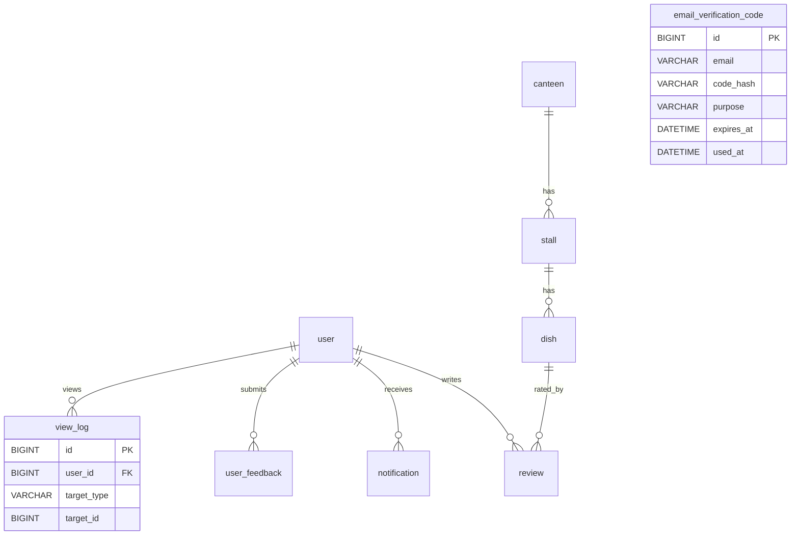

# 数据库设计（食在交大 bjtu_food）

> 本文档基于 `server/src/main/resources/db/schema.sql` 自动核对生成，与当前实现严格一致。
> **2026-09-15 对账修订（蓝图 v1，权威 `project_spec.md` §7.23）**：删除已 DROP 列（`dish.portion` / `dish.serve_period` / `dish.limited`、`canteen`/`stall` 的 `status`/`audit_status`/`reject_reason` 6 列、`stall.business_hours`、`review.tags`）；`user.role` 收为两层（移除 `super_admin`）；`user.password` 标注为历史兼容列；`dish.region` 改为「风味 / 菜系」；清理已删除接口条目（`selectPromotionDishes` / `GET /dishes/promotions`）。
> **2026-09-15 阶段4 对账修订（用户批准，权威 `project_spec.md` §7.23 第 4 条）**：① **`dish.audit_status` 列与索引全量退役**——列已 DROP（存量库由 `schema.sql` 末尾幂等存储过程 `drop_dish_audit_status_column` 清理）、`idx_dish_audit` 一并删除、`idx_dish_heat` 收为 `(status, view_count, rating_count, avg_rating)`；**公开查询不再按该列过滤（`status='on'` 即公开展示）**；`DishConst.AUDIT_APPROVED` / `AuditStatusConst` / 一次性归一脚本 `normalize_dish_audit_status.sql` 同批删除。② **`canteen.created_by` / `stall.created_by` 两列退役**（DROP 归入同一幂等存储过程 `drop_canteen_stall_entity_fields`）。③ `dish.reject_reason` / `dish.created_by` / `user_feedback.*` **不动**（前者为退役历史列、后者保留）。**（2026-09-16 修订：`dish.reject_reason` / `dish.created_by` 与 `user_feedback.handler_id` / `user_feedback.contact` 四列已随零消费清理删除，见文首 2026-09-16 对账注。）**
> **2026-09-15 品类维度整链删除对账（用户拍板，权威 `project_spec.md` §7.22 第 1 条——原 Q-117「后台保留品类作归类用途」口径已撤销）**：`category` 表、`dish.category_id` 列、`idx_dish_category` 索引、`uk_category_code` 唯一键、关系图 / ER 图中的 `category` 节点**一律移除**；**表基线 12 → 11 张**。**定型口径：菜品按食堂 / 档口归属，不存在分类维度**（端上无、后台亦无）。⚠️ **待对齐（尚未收口）**：`server/src/main/resources/db/schema.sql` / `seed_data.sql` 中的品类残留（建表、列、索引、种子数据与 `dish.category_id` 赋值）尚未清理，须以幂等段移除（先判存在再 DROP、可重复执行、**禁止直连 ALTER**）；**清理完成前，本文件「与 `schema.sql` 严格一致」的声明不成立**，收尾项登记见 `project_spec.md` §8「待收尾」。
> **2026-09-15 取消人工复核对账修订（用户拍板「取消人工复核」，权威 `project_spec.md` §7.24）**：**`review.sec_state` 与 `user_feedback.sec_state` 两列已全链退役**——CREATE TABLE 不再创建，存量库由 `schema.sql` 末尾幂等存储过程 `drop_sec_state_columns` 清理（先判存在再 DROP，可重复执行）；**评价可见性与评分聚合口径收敛为仅 `is_hidden=0` 单一判据**（微信内容安全检测 `pass` / `review` 一律放行、仅 `risky` 拒绝且不落库）；`SecStateConst`、复核端点 `PUT /admin/reviews/{id}/sec-state`、实体 / DTO / VO 的 `secState` 字段、列表筛选入参与 `OperationLogConst.ACTION_REVIEW_SEC_STATE` 同批删除；一次性重算脚本 `fix_rating_by_sec_state.sql` **已删除**。**表基线仍 11 张（本次为纯列级变更，不增删表）。**
> **2026-09-15 操作日志全链删除对账修订（用户拍板，权威 `project_spec.md` §7.25 第 1 条）**：**管理端「操作日志」全链移除**——`operation_log` 表**不再创建**（存量库由 `schema.sql` 末尾幂等存储过程 `drop_operation_log_table` 清理，先判存在再 DROP、可重复执行）；`OperationLog` 实体 / `OperationLogMapper` / `OperationLogService`(+`Impl`) / `OperationLogVO` / `OperationLogAdminController` / `@AuditLog` 注解 / `AuditLogAspect` 切面 / `OperationLogConst`（含品类四值 `category_*` 与 `ACTION_REVIEW_SEC_STATE`；**§8「待收尾」第 ② 项随之注销**）/ 4 处 `@AuditLog` 埋点调用一并删除；Web 端 `OperationLogView.vue` 与 `GET /admin/operation-logs` 端点同批移除。**表基线 11 → 10 张**。**保留**：`ClientIpUtil`（服务 `RequestLoggingFilter` 访问日志，与操作日志无关）、`view_log` 浏览足迹（**不动**）。
> **2026-09-15 冗余清理对账修订（用户拍板，后端并行落地中、按目标状态登记）**：① **`view_log` 两个零消费冗余索引删除**——`idx_view_user_time`(`user_id`,`created_at`) 与 `idx_view_target`(`target_type`,`target_id`) 全项目零查询使用（浏览量判重实际走 `idx_view_user_target_time`），索引清单同步移除；② **`user.last_login_at` 删除**（只写不读零消费）；③ **`user.role` 列删除**（写入点唯一且恒 `STUDENT`、admin 值无生产者）——**user 表语义收敛为「仅承载学生」，管理端无账号体系（口令制）既有口径不变**；三者为**纯列 / 索引级变更，表基线仍 10 张**。
> **2026-09-16 零消费列清理 + BCNF 声明 + 评分口径定稿对账（用户拍板「v1 基线冻结」，权威 `project_spec.md` §7.23 第 6 条；后端已落地）**：
> ① **6 个零消费列删除**（CREATE TABLE 不再创建，存量库由 `schema.sql` 幂等段 DROP，先判存在再 DROP、可重复执行）：`user.password`（管理端口令制 + 学生无密码体系，零校验零写入；**BCrypt 仅用于邮箱验证码哈希**）、`user.unionid`（单应用场景，撤销多应用预留）、`dish.reject_reason`（菜品无独立审核，原退役历史列零消费）、`dish.created_by`（只写不读）、`user_feedback.handler_id`（单口令即单人，原 retired 列零消费）、`user_feedback.contact`（**产品定型「不收集联系方式」**，列 / `FeedbackReq` 入参 / `FeedbackAdminVO` 出参全删）。**纯列级变更，表基线仍 10 张**。
> ② **BCNF 声明**：本库设计满足 BCNF；**唯一注册的反规范化**为 `dish.avg_rating` / `dish.rating_count` / `dish.view_count`（~~及 `review.useful_count`~~ ——**该列已于 2026-09-20 随「评价有用」全链下线删除**，见文首 2026-09-20 对账注）——由异步事件维护的计数列，服务于热度 / 榜单排序性能；其**单一数据源**为 `review` / `view_log`（聚合列恒可由源表重算恢复）。恢复纯 BCNF（删除计数列、改实时聚合）须**重新拍板**。
> ③ **评分聚合口径定稿（「通过即收录」，2026-09-16 用户拍板）**：评分聚合 = **仅 `is_hidden=0` 的评价**（无其他任何过滤条件；`rating_count` 与「该菜品可见评价数」同口径）。**一次性重算 SQL 已交付用户（部署时可选执行，非必做）**——不执行则个别菜品的存量均分在该菜品下一次评价写入时自然纠正。
> ④ **术语正名**：本文件中「机检」统一表述为「**微信内容安全检测（`msgSecCheck`/`imgSecCheck`）**」；用户原话口径——「**评价的文本与图片通过微信内容安全检测即收录发布，不通过即拒绝；无任何人工环节**」。
> **2026-09-18 菜品价格字段精简对账（用户拍板，权威 `project_spec.md` §7.26）**：删除「折扣价」`promo_price` 列（存量库由 `schema.sql` 末尾幂等段先 `UPDATE dish SET price = promo_price WHERE promo_price IS NOT NULL` 再 DROP，先判存在再 DROP、可重复执行）；`dish.price` 定型为**现价（当前实际售价，已含折扣）**、`dish.original_price` 为**原价（可空）**，「有折扣」判据 = `original_price > price`。**纯列级变更，表基线仍 10 张**。
> **2026-09-20 菜品描述维度替换对账（用户拍板，权威 `project_spec.md` §7.28）**：`dish` 删 `spice_level` / `region` 两列、加 `diet_type` / `ingredients` / `flavor_tags` / `serve_temp` 四列（存量库由 `schema.sql` 幂等段先加新列、后 DROP 旧列；**禁止直连 ALTER**）；`region='清真'` 语义迁入 `diet_type='halal'`（存量数据转换由用户在部署前决定，**agent 不代跑 UPDATE**）。**纯列级变更，表基线仍 10 张**。
> **2026-09-20 标签 `dish.tags` 删除对账（用户拍板，权威 `project_spec.md` §7.29）**：`dish.tags` 列删除（存量库由 `schema.sql` 幂等段 DROP，先判存在再 DROP、可重复执行；**禁止直连 ALTER**）；`GET /dishes` 的 `tag` 查询参数一并删除。**纯列级变更**（表基线变化见下条「评价有用」下线注）。
> **2026-09-20 坐标与距离概念下线对账（用户拍板，权威 `project_spec.md` §7.31）**：**`canteen.latitude` / `canteen.longitude` 两列删除**（GCJ-02 坐标；存量库由 `schema.sql` 末尾幂等段 DROP，先判存在再 DROP、可重复执行；**禁止直连 ALTER**），配套删除 `add_canteen_location` 迁移存储过程（含逐食堂坐标 `CASE` 回填与 NULL 兜底 UPDATE）与 `seed_data.sql` 中 `canteen` INSERT 的两列赋值；`Canteen` 实体 / `CanteenInfoVO` / `DishVO` 坐标出参一并移除，端上不再有 Haversine 距离计算，**位置表达收敛为「食堂 · 楼层 · 档口名」**（`canteen.location` 描述字段保留）。**纯列级变更**（表基线变化见下条「评价有用」下线注）。
> **2026-09-20 评价「有用」全链下线对账（用户拍板，权威 `project_spec.md` §7.30 清单 #1 / `review-api-contract` spec）**：**`review_useful` 表与 `review.useful_count` 列删除——数据表基线 10 → 9 张**（本次唯一表级变更）；存量库由 `schema.sql` 末尾幂等段 `drop_review_useful_chain` 先 DROP 列再 DROP 表（先判存在再 DROP、可重复执行；**禁止直连 ALTER**）。连带：投票端点 `POST /reviews/{id}/useful`、`ReviewVO.useful` / `usefulCount`、`ReviewAdminVO.usefulCount`、Web 评价列表「有用」列、`UsefulResult` / `ReviewUseful` / `ReviewUsefulMapper` / `ReviewConst` 一并删除；`review` 表 CREATE 不再创建 `useful_count`，`seed_data.sql` 不再灌入该表数据。**热度公式与评分聚合均不含有用数，无下游依赖**（`heatScoreExpr` 权重未变）。
> 数据库名：`bjtu_food`；字符集：`utf8mb4` / `utf8mb4_general_ci`；引擎：`InnoDB`。

## 1. 设计约定

| 约定 | 说明 |
|------|------|
| Schema | 所有表与迁移脚本均使用 `bjtu_food` 库（脚本内 `CREATE DATABASE IF NOT EXISTS` + `USE bjtu_food`） |
| 主键 | 业务表统一 `BIGINT AUTO_INCREMENT`；`email_verification_code` 等同样自增主键 |
| 时间戳 | `created_at` 默认 `CURRENT_TIMESTAMP`；`updated_at` 默认 `CURRENT_TIMESTAMP ON UPDATE CURRENT_TIMESTAMP`（由 `MybatisMetaObjectHandler` 统一写入） |
| 金额 | 以「分」为单位存储 `INT`（如 12.00 元 = `1200`），避免浮点误差 |
| 多图/列表 | JSON 字符串存储（如 `["url1","url2"]`，用于菜品/食堂/档口图；**2026-09-13 起 UGC 评价/反馈恢复 `images` 列**：同为 JSON 数组字符串，≤3 项 COS URL，见 §3.5 / §3.9） |
| 内容安检 | UGC（评价/反馈）文本与配图**提交时**过**微信内容安全检测**（`msgSecCheck` v2 / `imgSecCheck`；**2026-09-16 术语正名：旧称「机检」废止**）——**`pass` 与 `review`（疑似）一律放行，仅 `risky`（含未知 / 缺失态 fail-closed 同按 risky）拒绝且不落库**。**用户原话口径（2026-09-16 定稿）：「评价的文本与图片通过微信内容安全检测即收录发布，不通过即拒绝；无任何人工环节」**（2026-09-15 用户拍板「取消人工复核」，见 `project_spec.md` §7.24）；**安检态无落库列**——`review.sec_state` / `user_feedback.sec_state` 两列已全链退役；评价可见性唯一判据 = `is_hidden=0` |
| 审核流 | **2026-09-15 蓝图 v1（`project_spec.md` §7.23 第 4 条）+ 阶段4 全量退役：菜品无独立审核**——`dish.audit_status` **列与索引已删除**（公开查询不再按该列过滤，`status='on'` 即公开展示），`dish.reject_reason` **列已删除（2026-09-16 零消费清理，原「退役历史列、列保留」口径作废）**，后台无审核入口、端上无「菜品审核」概念，管理员录入 / 编辑即直接生效；`stall` / `canteen` 的 `audit_status` / `reject_reason` 已于 2026-09-14 随去实体化 DROP。**唯一有待处理态的运营对象是 `user_feedback`**（`status` pending/handled + `reply` 回执；不采纳 / 退回写 `reject_reason`） |
| 角色 | **`user.role` 列已于 2026-09-15 冗余清理删除**（写入点唯一且恒 `STUDENT`、admin 值无生产者）——**user 表仅承载学生、无角色字段**；管理端无账号体系（环境变量口令制）既有口径不变。`verified` 仅表示邮箱认证态，**不进 JWT**，后端实时判定 |
| 外键 | 逻辑外键为主（`user_id`/`stall_id`/`dish_id` 等建普通索引）；脚本中 `SET FOREIGN_KEY_CHECKS` 用于迁移幂等，业务层以应用级关联为主 |
| 幂等迁移 | MySQL 不支持 `ADD COLUMN IF NOT EXISTS` / `CREATE INDEX IF NOT EXISTS`，旧库升级通过存储过程 + `INFORMATION_SCHEMA` 判断补齐 |

## 2. 表清单（共 9 张表）

`user` · `canteen` · `stall` · `dish` · `review` · `notification` · `user_feedback` · `email_verification_code` · `view_log`

> **2026-09-15 操作日志下线：表基线 11 → 10 张**——`operation_log` 表随管理端「操作日志」全链删除不再创建（存量库由 `schema.sql` 末尾幂等存储过程 `drop_operation_log_table` 清理，见 §3.11 与文首对账注）。**本项目不存在任何操作日志 / AOP 审计落库能力。**
> **2026-09-20 评价「有用」下线：表基线 10 → 9 张**——`review_useful` 表随「评价有用」全链删除不再创建（存量库由 `schema.sql` 末尾幂等段 `drop_review_useful_chain` 清理，见 §3.6 与文首 2026-09-20 对账注）；`review.useful_count` 冗余列同批删除。**恢复须重新拍板。**
> 说明：**`category`（菜品品类）表已于 2026-09-15 随「品类维度整链删除」移除**（用户撤销原 Q-117「后台保留归类用途」口径，见 `project_spec.md` §7.22 第 1 条），**表基线 12 → 11**；定型口径 = **菜品按食堂 / 档口归属，不存在分类维度**。`broadcast` 与 `activity` 两表已于 2026-09-13 随活动/公告（broadcast）全链路下线删除（基线由 14 收敛为 12，见 `project_spec.md` §0.5）；`review_useful` 与 `review.useful_count` 冗余列配合使用（一人一票，由聚合维护）；`favorites` 收藏表已整体移除；`apply_action` 表已于 2026-09-12 随「贡献链路下线」删除（贡献统一走反馈 error/add 类型）。**2026-09-13 UGC 配图与内容安检（`review.images` / `user_feedback.images`）以列扩展落地，不新建表（该时点基线维持 12 张；**2026-09-15 品类表下线后为 11 张，操作日志表下线后当前基线为 10 张**，见本段首句与上段）**；**其配套的 `review.sec_state` / `user_feedback.sec_state` 两列已于 2026-09-15 随「取消人工复核」全链退役**（不再创建，存量库由 `drop_sec_state_columns` 幂等清理）。

---

## 3. 表结构详情

### 3.1 user（用户）
| 字段 | 类型 | 可空 | 默认 | 说明 |
|------|------|------|------|------|
| id | BIGINT | 否 | AUTO | 用户ID |
| username | VARCHAR(64) | 否 | '' | 学号/工号；游客建号为 `wx_`+openid 尾16位（唯一） |
| email | VARCHAR(128) | 可 | NULL | 校园邮箱（历史迁移凭证；游客为 NULL） |
| nickname | VARCHAR(64) | 否 | '' | 昵称 |
| avatar | VARCHAR(512) | 可 | NULL | 头像URL |
| status | VARCHAR(32) | 否 | 'active' | active/disabled/deleted |
| openid | VARCHAR(64) | 可 | NULL | 微信 openid（静默登录取号依据，唯一） |
| verified | TINYINT | 否 | 0 | 认证态：0=游客 / 1=已邮箱认证 |
| bind_email | VARCHAR(128) | 可 | NULL | 已认证绑定邮箱（仅存关系，可空） |
| verified_at | DATETIME | 可 | NULL | 认证时间 |
| created_at | DATETIME | 否 | NOW | 创建时间 |
| updated_at | DATETIME | 否 | NOW | 更新时间 |

**索引/约束**：PK(`id`)；UNIQUE `uk_user_username`(`username`)；UNIQUE `uk_user_email`(`email`)；UNIQUE `uk_user_openid`(`openid`)。

> **表语义（2026-09-15 用户拍板）**：**user 表仅承载学生**——微信静默登录建号的对象只有学生；管理端无账号体系（环境变量口令制）。JWT 不含 role claim（学生态 authorities 固定），web 学生列表亦不按 role 过滤。
>
> **已下线列（2026-09-15 冗余清理，字段生命周期成对处置 PR-07）**：`user.role`（角色，原两层 student/admin 数据语义，`super_admin` 已于 2026-09-14 先行移除）与 `user.last_login_at`（最近登录时间，只写不读零消费）两列已删除——CREATE TABLE 不再创建，存量库由 `schema.sql` 幂等存储过程 DROP（先判存在再 DROP、可重复执行）；实体 / VO / Mapper 列映射与 web 学生列表的 role 过滤同批移除。
>
> **已下线列（2026-09-16 零消费清理，见文首对账注 ①）**：`user.password`（密码哈希——**管理端口令制 + 学生端无密码体系，三端零校验零写入**；BCrypt 仅用于邮箱验证码哈希 `email_verification_code.code_hash`）与 `user.unionid`（微信 unionid——单应用场景、全链无读取消费，**撤销多应用预留**）两列已删除——CREATE TABLE 不再创建，存量库由 `schema.sql` 幂等段 DROP；实体 / VO / DTO 列映射同批移除，注销匿名化不再处置这两列。**列已从本表删除，勿再据旧文档引用。**

### 3.2 canteen（食堂）
| 字段 | 类型 | 可空 | 默认 | 说明 |
|------|------|------|------|------|
| id | BIGINT | 否 | AUTO | 食堂ID |
| name | VARCHAR(64) | 否 | '' | 食堂名称 |
| images | VARCHAR(1024) | 可 | NULL | 图片URL列表 JSON |
| location | VARCHAR(128) | 可 | NULL | 食堂位置 |
| description | VARCHAR(512) | 可 | NULL | 描述 |
| sort_order | INT | 否 | 0 | 排序权重（小靠前） |
| created_at / updated_at | DATETIME | 否 | NOW | 时间戳 |

**索引/约束**：PK(`id`)。

> **已下线列（2026-09-14 Q-113 / Q-119，食堂 / 档口去实体化为「菜品筛选属性字典」）**：`canteen` / `stall` 的 `status`、`audit_status`、`reject_reason` 共 6 列已由 `schema.sql` 幂等存储过程 `drop_canteen_stall_entity_fields` DROP，CREATE TABLE 亦不再创建；实体 / VO / Service 读写同批移除。字典能力集合仅「列表查看 / 新增 / 改名」，**无删除**（spec §7.22 第 5 条）。**2026-09-15 阶段4 追加**：`canteen.created_by` / `stall.created_by` 两列同批退役（无归属语义、写侧恒系统占位值、三端零消费）——CREATE TABLE 不再创建，DROP 归入同一幂等存储过程 `drop_canteen_stall_entity_fields`（先判存在再 DROP，可重复执行）；对应 `CanteenAdminVO` / `StallAdminVO` 的 `createdBy` 出参已删除。`dish.created_by` 与 `user_feedback.*` 列**不动**（**2026-09-16 修订：`dish.created_by` 与 `user_feedback.handler_id` / `user_feedback.contact` 已随零消费清理删除**，见文首对账注）。
>
> **已下线列（2026-09-20 坐标 / 距离概念全链下线，见 `project_spec.md` §7.31）**：`latitude`（纬度，GCJ-02）与 `longitude`（经度，GCJ-02）两列已删除——CREATE TABLE 不再创建，存量库由 `schema.sql` 末尾幂等段 DROP（先判存在再 DROP、可重复执行），`add_canteen_location` 迁移存储过程整体移除；`Canteen` 实体 / `CanteenInfoVO` / `DishVO` 坐标出参与端上 Haversine 距离计算一并移除，**位置表达收敛为「食堂 · 楼层 · 档口名」（`location` 描述字段保留）**。

### 3.3 stall（档口）
| 字段 | 类型 | 可空 | 默认 | 说明 |
|------|------|------|------|------|
| id | BIGINT | 否 | AUTO | 档口ID |
| canteen_id | BIGINT | 否 | 0 | 所属食堂ID |
| name | VARCHAR(64) | 否 | '' | 档口名称 |
| images | VARCHAR(1024) | 可 | NULL | 多图 JSON |
| location | VARCHAR(128) | 可 | NULL | 位置 |
| floor | VARCHAR(16) | 可 | NULL | 楼层（如 1F） |
| window_no | VARCHAR(32) | 可 | NULL | 窗口号 |
| description | VARCHAR(512) | 可 | NULL | 描述 |
| sort_order | INT | 否 | 0 | 排序权重 |
| created_at / updated_at | DATETIME | 否 | NOW | 时间戳 |

**索引/约束**：PK(`id`)；KEY `idx_stall_canteen`(`canteen_id`)。

> **已下线列**：`stall.business_hours`（营业时间）已于 2026-09-14 §7.14 第 4 条下线（`drop_stall_business_hours` 幂等 DROP）；`status` / `audit_status` / `reject_reason` 见上节说明。`floor`（楼层）与 `window_no`（窗口号）**保留**（端上有消费）。

### 3.4 dish（菜品）
| 字段 | 类型 | 可空 | 默认 | 说明 |
|------|------|------|------|------|
| id | BIGINT | 否 | AUTO | 菜品ID |
| stall_id | BIGINT | 否 | 0 | 所属档口ID |
| name | VARCHAR(64) | 否 | '' | 菜品名称 |
| price | INT | 否 | 0 | 现价（分，当前实际售价，**已含折扣**） |
| original_price | INT | 可 | NULL | 原价（分，折扣前）；**「有折扣」判据 = `original_price > price`**（2026-09-18 §7.26） |
| description | VARCHAR(512) | 可 | NULL | 描述 |
| images | VARCHAR(1024) | 可 | NULL | 多图 JSON |
| alias | VARCHAR(255) | 可 | NULL | ~~搜索别名~~ **已决议删除（2026-09-21 拍板，搜索契约精简）**：关键词直接硬匹配菜名 / 档口名 / 食堂名，不再需要别名层；存量库将由 `schema.sql` 幂等段 DROP（**代码待落地**，落地前列与匹配路仍在） |
| diet_type | VARCHAR(16) | 可 | NULL | **荤素 / 饮食属性**（2026-09-20 §7.28）：`meat`=荤 / `half`=半荤 / `veg`=素 / `halal`=清真（原 `region='清真'` 迁入） |
| ingredients | VARCHAR(255) | 可 | NULL | **主料 / 食材**（逗号分隔机器值，同 `tags` 模式）：pork/beef/lamb/chicken/duck/fish/egg/tofu/mushroom/veg/noodle/rice |
| flavor_tags | VARCHAR(128) | 可 | NULL | **口味**（逗号分隔机器值）：spicy/numbing/sour/sweet/salty/umami/light/heavy（**吸收原「辣度」语义**） |
| serve_temp | VARCHAR(16) | 可 | NULL | **冷热**：`hot`=热食 / `room`=常温 / `ice`=冰 |
| meal_type | VARCHAR(16) | 可 | NULL | **菜品大类**（2026-09-21 新增，`project_spec.md` §7.34）：单值枚举 `set_meal` / `stir_fry` / `noodle` / `dry_pot` / `snack` / `soup_drink`；取值白名单 = 后端常量 `MealTypeConst`（标签文案与顺序的唯一真源）；**不进公开 `DishVO` 出参**（仅参与筛选与字典下发），后台 `DishAdminReq` / `DishAdminVO` 使用 |
| status | VARCHAR(32) | 否 | 'on' | 上架：on/off（**菜品唯一的运营开关**） |
| view_count | INT | 否 | 0 | 浏览量（**口径定论（2026-09-18）：一直累计、不清零**；**仅作热度排序与热搜派生输入，不对外出参**，见 `project_spec.md` §7.27） |
| avg_rating | DECIMAL(3,2) | 可 | NULL | 平均评分 |
| rating_count | INT | 否 | 0 | 评价数 |
| created_at / updated_at | DATETIME | 否 | NOW | 时间戳 |

**索引/约束**：PK(`id`)；KEY `idx_dish_stall`(`stall_id`)；KEY `idx_dish_heat`(`status`,`view_count`,`rating_count`,`avg_rating`)（热度/推荐/榜单排序覆盖索引）。**`idx_dish_category`(`category_id`) 已随品类维度整链删除一并移除（2026-09-15，见 §2 说明与 `project_spec.md` §7.22 第 1 条）**。**`idx_dish_audit`(`audit_status`) 已随 `audit_status` 列退役一并删除（2026-09-15 阶段4）**；`idx_dish_heat` 同步退化为上述四列，与 CREATE TABLE 定义一致（DROP COLUMN 连带删索引，无需重建）。

> **2026-09-21 菜品大类对账（用户拍板，权威 `project_spec.md` §7.34）**：`dish` 新增 `meal_type` 列（`schema.sql` 幂等段 `add_dish_meal_type` = 先判 `INFORMATION_SCHEMA` 存在再 `ADD COLUMN`；`seed_data.sql` 按「新增列后回填」惯例幂等 UPDATE 全量赋值 31 条）——**禁止直连 ALTER**。**纯列级变更，表基线仍 10 张**。见下方字段表。
>
> **已下线列**：`promo_price`（折扣价）已于 2026-09-18 随「菜品价格字段精简」删除（`project_spec.md` §7.26）——存量库由 `schema.sql` 末尾幂等段先 `UPDATE dish SET price = promo_price WHERE promo_price IS NOT NULL` 再 DROP（先判存在再 DROP、可重复执行）；**折扣由 `price`（现价，已含折扣）与 `original_price`（原价，可空）两态表达**。
>
> **（2026-09-20 追加）**：`spice_level`（辣度）/ `region`（风味 / 菜系）两列随「描述维度替换」删除（`project_spec.md` §7.28）——`schema.sql` 幂等段**先加** `diet_type` / `ingredients` / `flavor_tags` / `serve_temp`、**后 DROP** 旧列（先判存在再 DROP、可重复执行；**禁止直连 ALTER**）。

> **已下线列（2026-09-14 用户拍板，字段生命周期成对处置 PR-07）**：`dish.serve_period`（餐段，§7.9 第 3 条）、`dish.limited`（限量，§7.9 第 4 条）、`dish.portion`（分量，§7.21 第 8 条 / Q-114）三列已整体下线——CREATE TABLE 不再创建，存量库由 `schema.sql` 幂等存储过程 `drop_dish_unused_fields` / `drop_dish_portion` DROP，实体 / VO / DTO / Mapper / 后台表单 / 端上映射全链路移除。**列已从本表删除，勿再据旧文档引用。**
> **已下线列（2026-09-15 用户拍板）：`dish.category_id`（品类归属）随品类维度整链删除一并移除**——CREATE TABLE 不再创建、`idx_dish_category` 连带移除，DTO（`DishAdminReq` / `DishQueryReq`）/ 实体 / VO（`DishVO` / `DishAdminVO`）/ Mapper 列映射 / 后台表单分类字段 / 菜品列表品类筛选与分类列全链路移除（`project_spec.md` §7.22 第 1 条，原 Q-117「后台归类用途」口径已撤销）。**列已从本表删除，勿再据旧文档引用。**
>
> **已下线列（2026-09-15 阶段4 用户批准「菜品无独立审核」）：`dish.audit_status` 全量退役**——**列与 `idx_dish_audit` 索引均不再创建**，存量库由 `schema.sql` **末尾**幂等存储过程 `drop_dish_audit_status_column`（先判存在再 DROP，可重复执行）清理；公开查询不再按该列过滤，**公开可见性唯一判据 = `status='on'`**。连带清理：`DishConst.AUDIT_APPROVED` 别名常量、`common/constant/AuditStatusConst` 值域真源、一次性归一脚本 `normalize_dish_audit_status.sql`（**均已删除**）；`Dish` 实体 / VO / DTO / Mapper 列映射同步移除。**列已删除，`normalize_dish_audit_status.sql` 不再存在，勿再引用。**
>
> **已下线列（2026-09-16 零消费清理，见文首对账注 ①）**：`dish.reject_reason`（原审核退回原因——菜品无独立审核后为退役历史列，恒 NULL、全链零消费）与 `dish.created_by`（提交人——只写不读，无任何展示 / 查询消费）两列已删除——CREATE TABLE 不再创建，存量库由 `schema.sql` 幂等段 DROP；实体 / VO / DTO / Mapper 列映射同批移除。「不采纳 / 退回」语义由 `user_feedback.reject_reason` 唯一承载。**列已从本表删除，勿再据旧文档引用。**

### 3.5 review（评价）
| 字段 | 类型 | 可空 | 默认 | 说明 |
|------|------|------|------|------|
| id | BIGINT | 否 | AUTO | 评价ID |
| user_id | BIGINT | 否 | 0 | 评价者用户ID |
| dish_id | BIGINT | 否 | 0 | 被评价菜品ID |
| rating | INT | 否 | 0 | 评分（1-5星） |
| content | VARCHAR(512) | 可 | NULL | 评价内容 |
| images | VARCHAR(1024) | 可 | NULL | **评价配图（2026-09-13 恢复）**：JSON 数组字符串（`["cos-url1","cos-url2"]`，≤3 项 COS URL）；上传经 `POST /upload/images`（imgSecCheck 通过后转存 COS） |
| is_hidden | TINYINT | 否 | 0 | 是否隐藏（0正常/1管理员隐藏）——**评价公开可见性的唯一判据**（`is_hidden=0`） |
| created_at / updated_at | DATETIME | 否 | NOW | 时间戳 |

**索引/约束**：PK(`id`)；KEY `idx_review_dish`(`dish_id`)；KEY `idx_review_user`(`user_id`)；UNIQUE `uk_review_user_dish`(`user_id`,`dish_id`)（一人一评）。

> **已下线列（2026-09-15 用户拍板「取消人工复核」，字段生命周期成对处置 PR-07）**：`review.sec_state`（原三态安检态 `pass`/`review`/`rejected`）**已全链退役**——CREATE TABLE 不再创建，存量库由 `schema.sql` 末尾幂等存储过程 `drop_sec_state_columns` DROP；`SecStateConst`、复核端点 `PUT /admin/reviews/{id}/sec-state`、实体 / VO / DTO 的 `secState` 字段、列表筛选入参与 `OperationLogConst.ACTION_REVIEW_SEC_STATE` 同批删除。**列已从本表删除，勿再据旧文档引用**；评价公开展示条件收敛为 `is_hidden=0`。
>
> **已下线列（2026-09-20「评价有用」全链下线，见文首对账注）**：`useful_count`（有用计数）**已删除**——CREATE TABLE 不再创建，存量库由 `schema.sql` 末尾幂等段 `drop_review_useful_chain` DROP；`Review` 实体字段、`ReviewVO.useful` / `usefulCount`、`ReviewAdminVO.usefulCount` 同批移除，**避免 MP 读写不存在的列**。

### 3.6 ~~review_useful（评价有用标记）~~ —— **已删除（2026-09-20）**

**该表已随「评价有用」能力全链下线删除**（用户拍板，权威 `project_spec.md` §7.30 清单 #1）：CREATE TABLE 不再创建，存量库由 `schema.sql` 末尾幂等段 `drop_review_useful_chain` DROP（**数据表基线 10 → 9 张**）。原字段 `id` / `user_id` / `review_id` / `created_at`、唯一键 `uk_useful_user_review`、索引 `idx_useful_review` 一并作废；`POST /reviews/{id}/useful` 端点与三端「有用」展示同批删除。**勿再据旧文档引用该表；恢复须重新拍板（PR-04）。**

### 3.7 notification（消息通知）
| 字段 | 类型 | 可空 | 默认 | 说明 |
|------|------|------|------|------|
| id | BIGINT | 否 | AUTO | 通知ID |
| user_id | BIGINT | 否 | 0 | 接收用户ID |
| type | VARCHAR(32) | 否 | '' | `feedback_handle`（**唯一在产类型**：反馈 / 举报处理回执，仅已认证提交人可收到）/ `dish_audit`（**仅存量兼容，2026-09-14 Q-107 起不再产生新通知**——菜品无独立审核，见 spec §7.23 第 4 条） |
> **注（2026-09-15 DB-04）**：`seed_data.sql` 中 `type='dish_audit'` 的通知为**存量演示数据**（配合历史数据展示、非在产类型；后端不动 seed，仅文档登记）。
| title | VARCHAR(128) | 否 | '' | 通知标题 |
| content | VARCHAR(512) | 可 | NULL | 正文 |
| related_id | BIGINT | 可 | NULL | 关联对象ID（按 type 解释） |
| is_read | TINYINT | 否 | 0 | 已读：0未读/1已读 |
| created_at / updated_at | DATETIME | 否 | NOW | 时间戳 |

**索引/约束**：PK(`id`)；KEY `idx_notification_user`(`user_id`)。

> **已删除表（勿重建）**：**`review_useful`（评价有用标记）已于 2026-09-20 随「评价有用」全链下线删除**（表 + `review.useful_count` 列 + 投票端点 + 三端展示，详见 §3.6 与 `project_spec.md` §7.30；**表基线 10 → 9**）；**`operation_log`（操作日志）已于 2026-09-15 随「操作日志」全链删除移除**（表 + 实体 / Mapper / Service / VO / Controller / `@AuditLog` 注解 / `AuditLogAspect` 切面 / `OperationLogConst` 全链删除，详见 §3.11 与 `project_spec.md` §7.25 第 1 条；**表基线 11 → 10**）；**原 §3.8 `category`（菜品品类）已于 2026-09-15 随「品类维度整链删除」移除**（用户撤销原 Q-117「后台保留品类作归类用途」口径，定型口径 = 菜品按食堂 / 档口归属、不存在分类维度，见 `project_spec.md` §7.22 第 1 条；原字段 `code` / `name` / `sort_order` / `status` 与 `uk_category_code` / `idx_category_status_sort` 一并作废）；`broadcast`（首页广播条）与 `activity`（最新活动/公众号文章卡片）已于 2026-09-13 随活动/公告全链路下线从 `schema.sql` 删除（小程序端零消费，Web 管理页一并移除）。恢复须重新拍板。

### 3.8 user_feedback（用户反馈）
| 字段 | 类型 | 可空 | 默认 | 说明 |
|------|------|------|------|------|
| id | BIGINT | 否 | AUTO | 反馈ID |
| user_id | BIGINT | 否 | 0 | 用户ID |
| type | VARCHAR(32) | 否 | 'suggestion' | **写入白名单（2026-09-15 蓝图 v1 真源，spec §7.23 第 3 条）= `suggestion` / `add` / `error` / `report`**：`suggestion` 建议 / 问题（端上二级 `sub`，见下行）、`add` 新增菜品投稿、`error` 信息纠错与申请下架（`related_type=dish`）、`report` 举报（`related_type=review`）。**`bug` / `other` 为历史遗留枚举位、无生产者、禁止新增**，仅保留在查询白名单以筛存量数据 |
| sub | VARCHAR(16) | 可 | NULL | **反馈二级类型（2026-09-15 用户拍板，spec §7.23 第 3 条）**：值域 `idea`（建议·想法）/ `problem`（建议·问题），**仅 `type='suggestion'` 有效**；写入白名单校验、非法值（含非 `suggestion` 类型携带）400、不静默降级；后台展示为「建议·想法 / 建议·问题」，**不新增筛选维度**。**新库 CREATE TABLE 直接含此列；旧库由 `schema.sql` 幂等存储过程加列**（先判 `INFORMATION_SCHEMA` 存在性再 `ADD COLUMN`，可重跑，列定义与 CREATE 一致） |
| content | VARCHAR(1024) | 否 | '' | 反馈内容 |
| images | VARCHAR(1024) | 可 | NULL | **反馈配图（2026-09-13 恢复）**：JSON 数组字符串（≤3 项 COS URL）；上传经 `POST /upload/images`（imgSecCheck 通过后转存 COS），游客提交同样可带图 |
| status | VARCHAR(32) | 否 | 'pending' | pending/handled（**全项目唯一有待处理态的运营对象**，spec §7.23 第 5 条）。**处理结论 `outcome`（`handled`=通过/已处理（缺省）/`rejected`=不采纳/退回）为请求级字段（`FeedbackHandleReq.outcome`，蓝图 v1），不单独落列**：两种结论落库均写 `status='handled'`，结论差异由 `reject_reason` 是否非空承载（rejected 必填原因、handled 保持 NULL） |
| reply | VARCHAR(1024) | 可 | NULL | 管理员回执（**必填**，1~1000 字，投递为站内通知 `feedback_handle`，回执区分「反馈已处理 / 反馈未采纳」） |
| reject_reason | VARCHAR(200) | 可 | NULL | **不采纳/退回原因（2026-09-15 蓝图 v1 §7.23 第 5 条，已由规划列转正式列，DDL 随 `schema.sql` 幂等块 `add_feedback_reject_reason` 落地）**：处理结论 `outcome=rejected` 时必填（1~200 字，纯空白视为未填写 → 400），随回执通知一并向已认证提交人展示；`outcome=handled` 时不消费、保持 NULL |
| related_type | VARCHAR(32) | 可 | NULL | 关联类型（举报：review；信息纠错：dish） |
| related_id | BIGINT | 可 | NULL | 关联对象ID（举报：评价ID；信息纠错：菜品ID） |
| handled_at | DATETIME | 可 | NULL | 处理时间 |
| created_at / updated_at | DATETIME | 否 | NOW | 时间戳 |

**索引/约束**：PK(`id`)；KEY `idx_feedback_user`(`user_id`)。

> **已下线列（2026-09-15 用户拍板「取消人工复核」，PR-07）**：`user_feedback.sec_state`（原三态安检态 `pass`/`review`/`rejected`）**已全链退役**——CREATE TABLE 不再创建，存量库由 `schema.sql` 末尾幂等存储过程 `drop_sec_state_columns` DROP（与 `review.sec_state` 同段清理）；`FeedbackAdminVO` 的 `secState` 出参与列表筛选入参同批删除。**列已从本表删除，勿再据旧文档引用**——反馈微信内容安全检测 `pass` / `review` 一律放行、`risky` 不落库，不留复核标记。
>
> **已下线列（2026-09-16 零消费清理，见文首对账注 ①）**：`user_feedback.contact`（联系方式——**产品定型「不收集联系方式」**：前端无字段、`FeedbackReq` 入参无该字段、`FeedbackAdminVO` 不出参；原「列保留兼容历史」口径撤销）与 `user_feedback.handler_id`（处理人——单口令即单人、不追究操作人身份，原 retired 列全链零消费）两列已删除——CREATE TABLE 不再创建，存量库由 `schema.sql` 幂等段 DROP；实体 / VO / DTO 同批移除。**列已从本表删除，勿再据旧文档引用。**

### 3.9 email_verification_code（邮箱验证码）
| 字段 | 类型 | 可空 | 默认 | 说明 |
|------|------|------|------|------|
| id | BIGINT | 否 | AUTO | 记录ID |
| email | VARCHAR(128) | 否 | '' | 邮箱地址 |
| code_hash | VARCHAR(128) | 否 | '' | 验证码哈希（BCrypt） |
| purpose | VARCHAR(32) | 否 | 'verify' | verify（学号邮箱认证，替代旧 login/register/reset） |
| expires_at | DATETIME | 可 | NULL | 过期时间 |
| used_at | DATETIME | 可 | NULL | 使用时间（已用则非空） |
| created_at | DATETIME | 否 | NOW | 创建时间 |

**索引/约束**：PK(`id`)；KEY `idx_evc_email`(`email`,`purpose`)；KEY `idx_evc_expires`(`expires_at`)。

### 3.10 view_log（浏览足迹）
| 字段 | 类型 | 可空 | 默认 | 说明 |
|------|------|------|------|------|
| id | BIGINT | 否 | AUTO | 足迹ID |
| user_id | BIGINT | 否 | 0 | 浏览者用户ID |
| target_type | VARCHAR(32) | 否 | '' | dish/stall/canteen |
| target_id | BIGINT | 否 | 0 | 浏览对象ID |
| created_at / updated_at | DATETIME | 否 | NOW | 时间戳 |

**索引/约束**：PK(`id`)；KEY `idx_view_user_target_time`(`user_id`,`target_type`,`target_id`,`updated_at`)（**判重复合索引，2026-09-15 新增**：后端浏览量判重已改用 `updated_at`，四列组合覆盖判重查询；新库 CREATE TABLE 已含，旧库由 `schema.sql` 幂等存储过程 `add_view_log_dedup_index` 补建）。**~~`idx_view_user_time`(`user_id`,`created_at`) / `idx_view_target`(`target_type`,`target_id`)~~ 已于 2026-09-15 冗余清理删除——两索引全项目零查询使用（判重实际走 `idx_view_user_target_time`），不再创建。**

> **表定位（2026-09-15 口径修正）**：**`view_log` 仅作浏览量当日去重判据（`HistoryService` 判重）与浏览计数来源**；「猜你喜欢」个性化推荐已随 spec §7.10 第 1 条下线，不再是本表下游消费者。
>
> **写入语义（2026-08-19 修复补齐）**：~~此前仅 `HistoryService.recentViewedDishIds` 读取、无写入，导致「猜你喜欢」个性化数据缺失（历史留痕，该消费方已下线）~~。现已在菜品浏览量自增（`DishServiceImpl.addViewCount`）时同步 `recordDishView` 写入，采用「存在则更新 updated_at、不存在则插入」的去重 upsert 语义（同 userId+target_type=dish+targetId 不重复插入）。表无唯一键，去重依赖应用层 update-else-insert。

### 3.11 ~~operation_log（操作日志，AOP 埋点，Web 只读）~~ —— **已删除（2026-09-15）**

> **已删除表（勿重建）：「操作日志」全链删除（2026-09-15 用户拍板，权威 `project_spec.md` §7.25 第 1 条）**——`operation_log` 表**不再创建**（`schema.sql` 末尾幂等存储过程 `drop_operation_log_table` 清理存量库，先判存在再 DROP、可重复执行），其 `id` / `admin_id` / `action` / `target_type` / `target_id` / `ip` / `created_at` 七列与索引 `idx_op_admin_time` / `idx_op_target` **全部作废、不再存在**。
>
> **连带删除（无任何残留能力）**：`OperationLog` 实体、`OperationLogMapper`、`OperationLogService`(+`ServiceImpl`)、`OperationLogVO`、`OperationLogAdminController` 与端点 `GET /admin/operation-logs`、`common/annotation/AuditLog` 注解、`AuditLogAspect` 切面、`OperationLogConst`（**含 `category_create` / `category_update` / `category_toggle` / `category_delete` 四值——`project_spec.md` §8「待收尾」第 ② 项随之注销；亦含早前退役的 `ACTION_REVIEW_SEC_STATE`**）、4 处 `@AuditLog` 埋点调用；Web 端 `OperationLogView.vue` 与 `api/operationLog.ts` / `OPERATION_*` 常量同批移除。
>
> **原 `action` 值域段落（`review_hide` / `review_delete` / `dish_delete` / `feedback_handle` / `account_delete` 五值及其待对齐收尾项）随本节整体作废，勿再据旧文档引用。**
>
> **保留（不属操作日志能力）**：`ClientIpUtil`（仅服务 `RequestLoggingFilter` 的服务端访问日志，与业务操作留痕无关）；`view_log`（浏览足迹）**不动**——仅作浏览量当日去重判据与浏览计数来源，与管理员操作留痕无关，见 §3.10。
>
> **口径定型**：管理端为**单人共享口令工具**（`X-Admin-Token`，见 §3.1 与 `project_spec.md` §7.10），**不提供也不恢复任何操作留痕 / 审计追溯页面**；恢复须重新拍板（PR-04）。相应地，`project_spec.md` §7.10 第 2 条「操作人身份降级」中涉及 `operation_log.admin_id` 的表述随之废止（**2026-09-16 修订：`user_feedback.handler_id` 列亦已随零消费清理删除，retired 口径终止**）。

---

## 4. 外键 / 关联关系

业务层以**应用级关联**为主（逻辑外键，索引见各表），下文为实体关系语义：

- `user` 1—N `review` / `notification` / `user_feedback` / `view_log`（均经 `user_id`）
- `canteen` 1—N `stall`（`stall.canteen_id`）
- `stall` 1—N `dish`（`dish.stall_id`）
- `dish` 1—N `review`（`review.dish_id`）。**~~`dish` N—1 `category`（`dish.category_id`）~~ 已于 2026-09-15 随品类维度整链删除移除**（`category` 表与 `dish.category_id` 均不存在，菜品只按食堂 / 档口归属）
- ~~`review` 1—N `review_useful`（`review_id`）~~ —— **已于 2026-09-20 随「评价有用」全链下线移除**（表不存在，评价侧无关联子表）
- `email_verification_code` 独立（按 `email`+`purpose` 查询）
- ~~`operation_log` 关联 `admin_id`（引用 `user.id` 的管理员）~~ —— **已于 2026-09-15 随「操作日志」全链删除移除**（表不存在，无 `user`—`operation_log` 关系；见 §3.11 与 `project_spec.md` §7.25 第 1 条）

### ER 图（Mermaid）

> **ER 图变更（2026-09-15）**：原 `operation_log` 实体块与 `user ||--o{ operation_log` 关系线已随「操作日志」全链删除移除（表不存在，见 §3.11）。
> **ER 图变更（2026-09-20）**：原 `review_useful` 关系线（`user ||--o{ review_useful`、`review ||--o{ review_useful`）已随「评价有用」全链下线移除（表不存在，见 §3.6）。

---

## 5. 关键约束与命名速查

| 唯一约束 | 表 | 列 | 作用 |
|----------|-----|-----|------|
| uk_user_username | user | username | 游客建号唯一 |
| uk_user_email | user | email | 邮箱唯一（允许 NULL，多游客不冲突） |
| uk_user_openid | user | openid | 微信登录唯一取号 |
| uk_review_user_dish | review | (user_id, dish_id) | 一人一评 |
| ~~uk_useful_user_review~~ | ~~review_useful~~ | ~~(user_id, review_id)~~ | **已删除（2026-09-20「评价有用」全链下线，`review_useful` 表已移除，见 §3.6）** |
| ~~uk_category_code~~ | ~~category~~ | ~~code~~ | **已删除（2026-09-15 品类维度整链删除，`category` 表已移除，见 §2 说明）** |

**覆盖索引（排序优化）**：`idx_dish_heat`(status, view_count, rating_count, avg_rating) 支撑推荐/榜单/热度排序（**2026-09-15 阶段4：原含 `audit_status` 的五列版本已随该列退役收窄为四列**）；`idx_view_user_target_time`(user_id, target_type, target_id, updated_at) 支撑浏览量判重（判重已改用 updated_at，2026-09-15）；~~`idx_view_user_time`(user_id, created_at) / `idx_view_target`(target_type, target_id)~~ ——**已于 2026-09-15 冗余清理删除，零查询使用、不存在**（见 §3.10）；~~`idx_op_admin_time` / `idx_op_target` 支撑操作日志查询~~ ——**两索引已于 2026-09-15 随 `operation_log` 表删除一并移除，不存在**（见 §3.11）。
